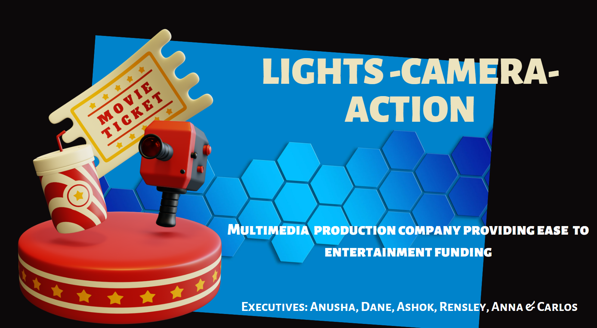
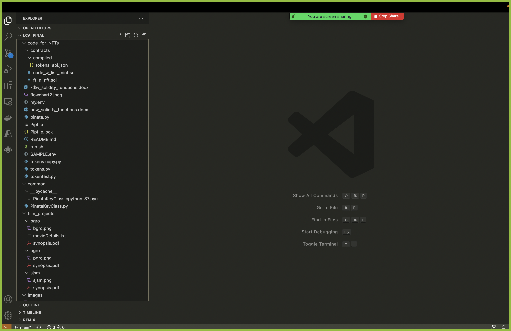
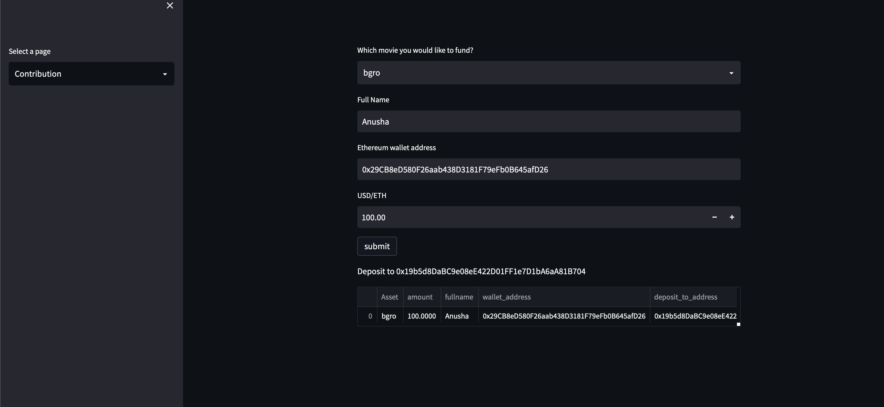
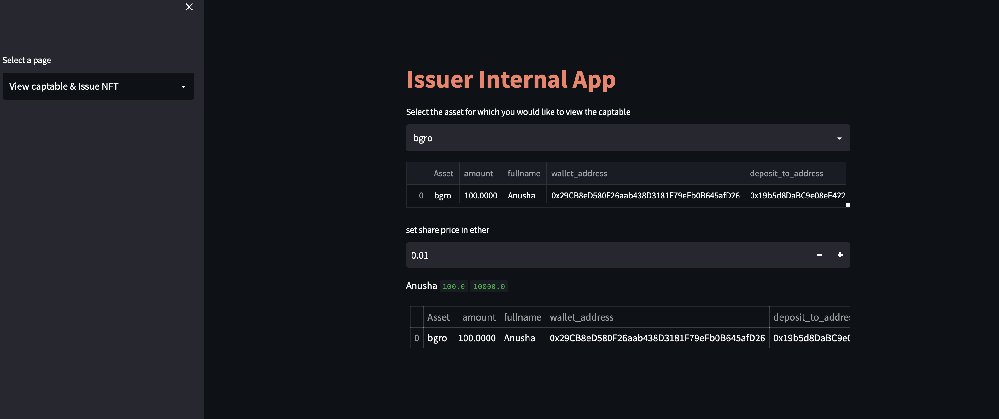
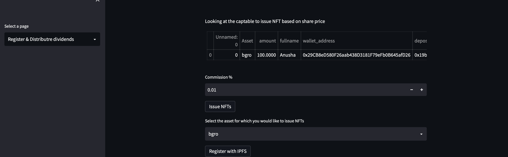

# Project 3: Cryvesto 3.0- Lights_Camera_Action
--- 




*"A novel enterprise to develop investment opportunities through FTs & NFT smartcontracts for a multi-media production company."* 


---
## Background
##
CryVesto PE seeks an innovative approach to address funding using the blockchain and smartcontracts for multi-media company "Light-Camera-Action"(LCA) to produce movies; games; NFTs; AR & VR platforms for education material and the multi-verse for theme centered fan entertainment. Observing the growing entertainment activity on the internet, with the increasing interest in cryptocurrency and NFTs we seek to address a need to utilize new FinTech technologies to support a wider market of investors. Our goal is to offer investment opportunities to financiers as High-Networth-Individuals(HNW) and provide a gateway to retail fans internationally using smartcontracts on the blockchain to defragmentize the global entertainment industry.

Utilizing our expertise in Fintech to broaden opportunities for retail investors brings prospective fans in closer proximity to passionately support their favorite artists and entertainment themes. This attracts a larger group of investors who ordinarily don't participate in financing films, music, games and other forms of entertainment projects. By attaching tangible IP assets with production projects, we can bring quantifiable returns to both fungible tokens (FTs) and non-fungible tokens(NFTs) in the LCA environment.   

The primary funding of LCA is from CryVesto PE with HNWs through securitized FTs on the blockchain and retail investors for secondary round of funding for their preferred entertainment projects. In this way, we can raise funds internationally for projects where the entertainment production is produced and lower financial expenses and transactions with "BollyCoin" tokens. 

Currently the entertainment industry is regionally isolated in its respective territorial markets, we’re migrating to a more inclusive global intercultural entertainment company. By including and addressing the needs of diverse cultures in entertainment, LCA also diversifies its portfolio revenue streams for greater chances of success and ROI for profits.  

---
--- 

## ACCEPTANCE CRITERIA
The Cryvesto project meets the following criteria: 
Functionality to provide user with registration for fungible tokens ("BollyCoin"Tokens) and non-fungible tokens (NFTs) to select choice of investible projects. Also, the need to provide royalties for (NFT) selections, while supporting investor NFT transactions for trade and provide FT balances in their accounts on a HD wallet.    

# 
* [PptPresentation](https://docs.google.com/presentation/d/1702vW2SxHXhDt5JQZEatg0zKgqI-4WXm/edit?usp=sharing&ouid=116787546129771746745&rtpof=true&sd=true) 

---
--- 

## Technologies 
The application is developed using:  
* Language: Python 3.7, Solidity, Javascript
* Libraries: Pandas; Streamlit, Solidity, ERC 1155
* Development Environment: VS Code and Terminal, Anaconda 2.1.1 with conda 4.11.0, Jupyterlab 3.2.9, Remix
* OS: Mac OS 12.1

The software program was built using 'Remix 0.25.1' IDE in a web app. The Remix IDE is an open-source application for developing, deploying, and administering smart contracts that run in Ethereum-based blockchains development environment. 

The programming language was developed in 'Solidity 0.5.0' to create a smart contract and code that works on the Ethereum blockchain. The OpenZeppelin libraries provide a variety of contracts that are related to the `ERC-20`, `ERC 721` configured in `ERC 1155` token standards. The `ERC 1155` standard defines some mandatory functions for fungibleToken and Non-FungibleToken smart contracts in our program.  

Using 'Granache 2.5.4' app allows a quick setup of a local blockchain in a development environment. 'MetaMask 10.18.0' is a is a digital wallet for the digital currency blockchain. Together they operate in an isolated decentralized environment mimicking the consensus engine of the Ethereum blockchain to perform functionality to the 'LCA'`ft_n_nft.sol` app in order to mint "BollyCoin" tokens and register NFT smartcontracts on the blockchain. 

After deployment of `ft_n_nft.sol` the core logic of our dApp, `InvestorApp.py`contains the code that uses Web3.py library; the environment file `.env` storing the deployed contract address, along with IPFS keys that store the NFT data, which is used to provide the capability to run the backend for our streamlit GUI. The streamlit GUI allows users to select their film project to invest and receive RoyalDividends for their NFTs. 

--- 
--- 

## Installation Guide
Before running the applications open your terminal to install the libraries and verify them. The following are instructions to install the libraries for the applications.  

* [python](https://www.python.org/downloads/) 
* [anaconda3](https://docs.anaconda.com/anaconda/install/windows/e) 
* [pandas](https://pandas.pydata.org/docs/getting_started/install.html)
* [streamlit](https://docs.streamlit.io/library/get-started/installation)
* Remix was used on the web -  https://remix.ethereum.org

```python libraries
pip install streamlit                                    # creates custom web GUI for 'LCA'.
```  
Below are the imports for the `InvestorApp.py` libraries in the program:

``` 
import os
import json
from web3 import Web3
from dotenv import load_dotenv
import pandas as pd
import streamlit as st
from pathlib import Path
import numpy as np
from PIL import Image
import base64
import numpy as np
import token
import sys
from os import path
import requests
import csv
import time
from common.PinataKeyClass import PinataKey
```  
#
### Clone the application code from Github as follows:
Copy the URL link of the application from its Github repository      
open the Terminal window and clone as follows:  

   1. %cd to_your_preferred_directory_where_you want_to_store_this_application  
    
   2. %git clone URL_link_that_was_copied_in_step_1_above   
    
   3. %ls       
        LCA_final  
        
   4. %cd LCA_final

The entire application files in the current directory are as follows:  

*The complete file listings for our program application*
  
    
LICENSE                         
P3-LCA_CryVesto3.0-Proposal.md  project_notes.txt
Movie-Projects.csv              
README.md                       
r&d  (R&d folder with all the research and constant deveopment code)

--- 
--- 

## Usage
The following details the instructions on how to run the applications.  

### Setup the environment and Run the application 

Setup the environment using conda as follows:

    5. %conda create dev -python=3.7 anaconda  
    
    6. %conda activate dev  (if running the Cryvesto app go to the section on `Setup Streamlit` below')

### Setup Streamlit
Before running the app, please make sure that Streamlit is installed on your system and the libraries mentioned above are installed as well. If Streamlit is not installed, follow these instructions:  

* pipenv install streamlit
* pipenv shell
* conda activate dev
* pip install web3
* pip3 install python-dotenv

### Run the LCA App

After step 6 of setting up the environment, follow these instructions:
    
     7. streamlit run InvestorApp.py
     
Follow the instructions in the User Interface below:
#
### APPLICATION 
#
#### SOLIDITY SMART CONTRACT

The smart contract was developed using the ERC1155 standard. The standard provided basic framework for the contract. It was enhanced with the following functionality, only some of it was used in the application. The code for the latest development is in the `ft_n_nft.sol` file in the r&d folder. This is under constant development. The code that was used for this phase of the app is in the `main` folder.

* Register the NFTs/TOKENS on BLOCKCHAIN 
    * registerToken()
* Set the Campaign Targets
    * setCampaignTarget() – set the campaign target (money in ETHs and time)
* Investor Mints/Buys NFT/TOKENS
    * mint function to mint the tokens
    * payForTokens to pay for tokens
* Extend Campaign time
* several other helper functions that are used by the main functions above and some that can be used manually through Remix
    * balanceTime() – remaining campaign duration
    * getUri() – get URI if u know the token ID
    * getIdFromUri() – Get the tokenID if u know the URI
    * tokenCount() – token count
    * updateTokenCount() – update the token counts
    * updateRefundTokenCount() – upon refund, update the token count
    * numberOfTokens() – number of tokens
    * updateMintedTokenCount()
* in the code you will see more functions that are under constant development, though they are not used

#### USER INTERFACE - Investor 
1. Investor reviews film projects of his/her interest.
     
2. Investor's interest in film project title receives additional summary information.
      
3. Investor's selected film project to contribute for investment.
      
    
#### USER INTERFACE - App Administration

* Register NFTs and Token in IPFS/local IPFS using Streamlit
* Setting Campaign Targets 
    * can be done through Streamlit Interface or
    * set using Remix
* Profit/Dividend analysis and Distribution
    - setting campaign targets
    - NFT Registration 

4.  LCA Disbursement Office registers and issues the NFT on the blockchain for investor account. 
     

5. LCA Disbursement Office registers and distributes royalties for NFTs and dividends for "BollyCoin" tokens
    

---
--- 
## Contributors 
Ashok Pandey - ashok.pragati@gmail.com, https://www.linkedin.com/in/ashok-pandey-a7201237  
Dane Hayes - nydane1@gmail.com, https://www.linkedin.com/in/dana-h-2a2a71243/  
Rensley Ramos - ranly196@gmail.com, https://www.linkedin.com/in/rensley-2-nfty/    
Anna Joltaya - annajolt11.04@gmail.com, https://www.linkedin.com/in/anna-joltaya-15a66387/  
Anusha Sundarajan - anusha.sundararajan@gmail.com, https://www.linkedin.com/in/anusha-sundararajan-89498628/  
Carlos Guerra - carlosalberto@alumni.ie.edu


---

## License 
Columbia U. Engineering   
CRYVESTO_3.0  
The source code is the property of the developer. The users can copy and use the code freely but the developer is not responsible for any liability arising out of the code and its derivatives.

---
[BSD 2-Clause LicenseCopyright (c) 2022, CryVesto PE/LCA  
All rights reserved.](/LICENSE)
